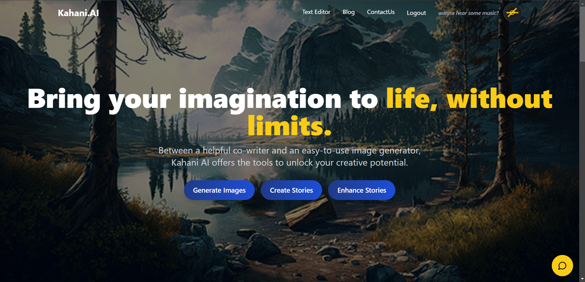
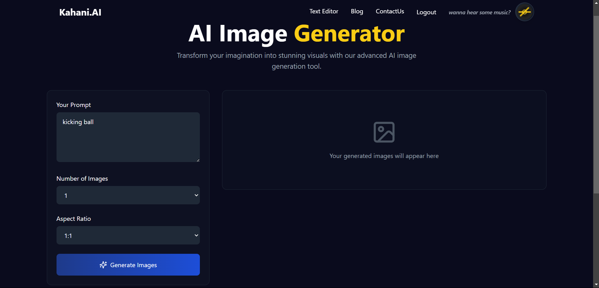
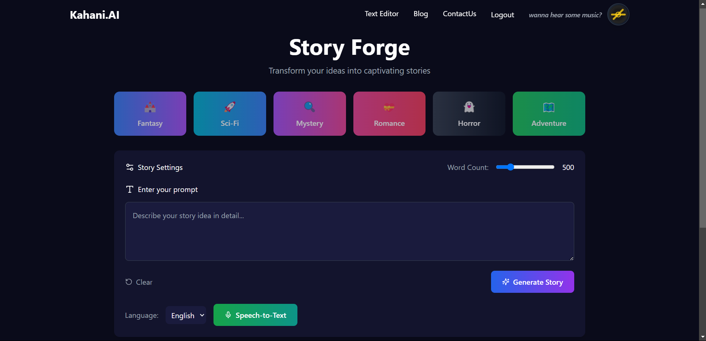
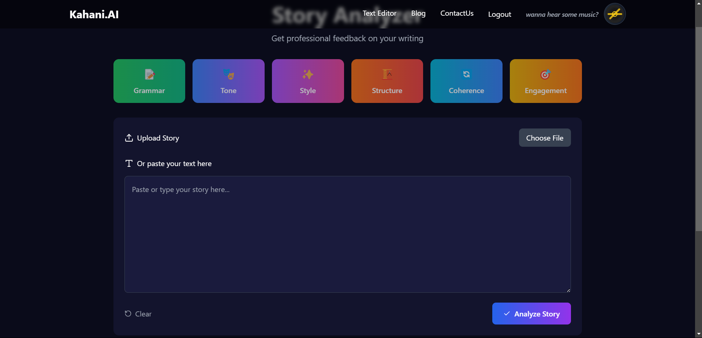
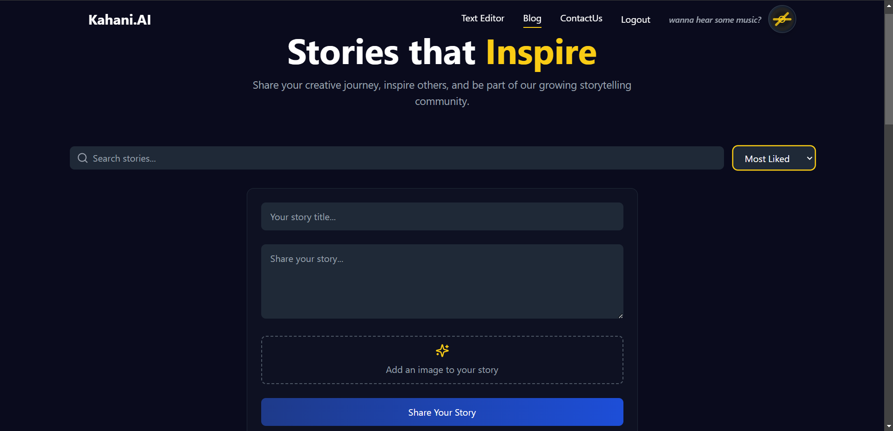
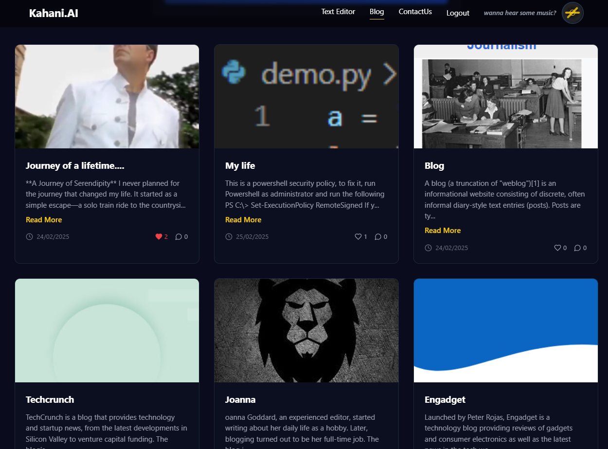
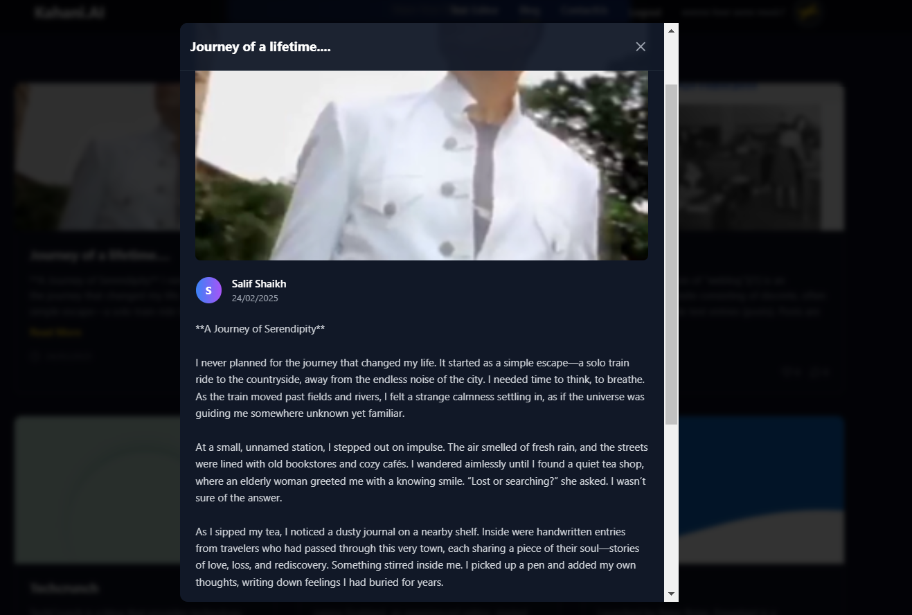
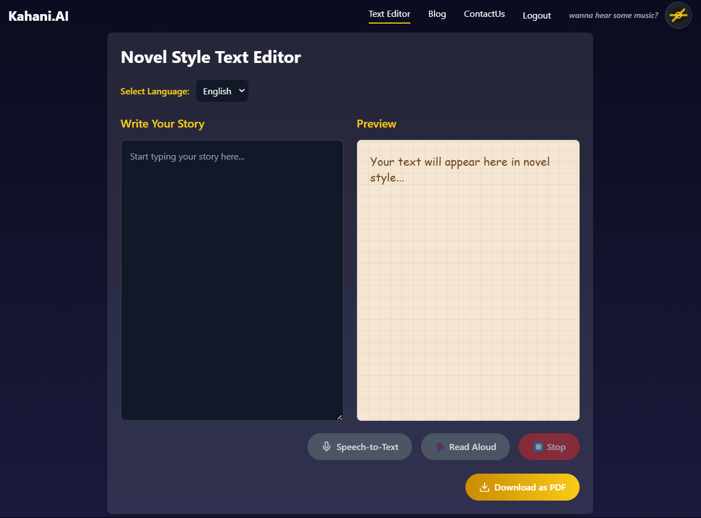
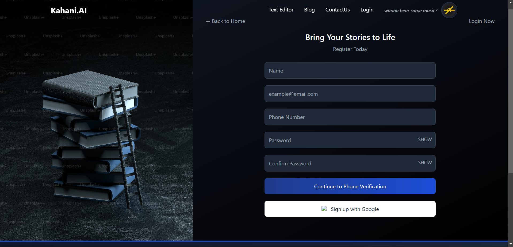

# KahaniAI

*A revolutionary AI-powered storytelling platform*

## 🚀 About KahaniAI
**KahaniAI** is an AI-driven storytelling platform that leverages multiple **LLM models** to generate and enhance stories. Whether you want to create short tales, enhance your writing, or convert text into engaging PDFs, KahaniAI has got you covered!

## ✨ Features

### 🖼️ AI-Powered Image Generation
- Generate stunning images based on prompts for your stories.
- AI ensures high-quality, theme-based visual content.

### 📖 Story Generation
- Choose from **100-word** or **200-word** formats for AI-generated stories.
- Creative, engaging, and customized storytelling using advanced LLM models.

### 📝 Story Enhancer
- Improve and expand existing stories with AI-powered suggestions.
- Enhances tone, readability, and engagement.

### ✍️ Rich Text Editor (PDF Export)
- Write and format your own stories with an intuitive text editor.
- **Export stories as PDFs** for easy sharing and publishing.

### 📰 Blog Page
- **Post and share blogs** about storytelling and creative writing.
- Users can **like and engage** with posts.

### 🔒 Secure Login with 2-Step Verification
- Phone number verification ensures a **secure** authentication process.
- Keeps user data protected.

### 🎵 Small Music Tool
- An integrated **music feature** for an immersive writing experience.
- Helps set the right mood while creating stories.

## 📸 Screenshots

### 🔹 Homepage

### 🔹 Image Generation

### 🔹 Story Generation

### 🔹 Story Enhancer

### 🔹 Blog Page

### 🔹 Text Editor

### 🔹 Signup and Verification

